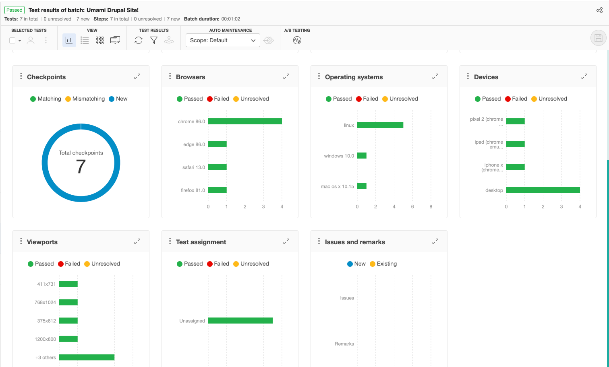

# Applitools Ultrafast Test Cloud with Cypress for Drupal Site

## Setup
1. For quick installation of drupal 8 site and lando, please refer this [axl-template repo](https://github.com/axelerant/axl-template) 
2. Setup the project with [Umami installation profile](https://www.drupal.org/docs/umami-drupal-demonstration-installation-profile)
3. Create a free [Applitools account](https://auth.applitools.com/users/register) and get the Applitools API KEY. Please refer to the official documentation for [Cypress + Applitools tutorial](https://applitools.com/tutorials/cypress.html)

## Notes

  * - [x] Setup Cypress in your project's root and the Page Object Design Pattern is implemented as below:
       + All test framework details are in web/themes/custom/cypress directory
       + Test files(cypress/integration): home.page.spec.spec.js; landing_pages.spec.js; listing_pages.spec.js
       + Supported/Common re-usable functions(cypress/support): commands.js, index.js
       + Plugin/Add-on components(cypress/plugins): index.js
       + Config file: cypress.json
       + Screenshots(cypress/screenshots): screenshots of all the failed tests
       + Videos folder(cypress/videos): vidoes of all test executions

## NPM Scripts for test execution

Clone/import this project in your drupal project and change the "baseUrl" field in cypress.json file as per your site. Next, follow the below steps and execute NPM scripts from the location(/web/themes/custom/axe-applitools):
   + **npm i** - install dependencies
   + set the value of an environment variable APPLITOOLS_API_KEY based on our OS as mentioned [here](https://www.npmjs.com/package/@applitools/eyes-cypress#applitools-api-key) or update that variable's value in this file: drupal/web/themes/custom/axe-applitools/.as-a.ini
   + In cypress/plugins/index.js, verify if APPLITOOLS_API_KEY is set. If not, set an environment variable to be read in the cypress/support/index.js file. If the variable is NOT set, the cy.eyesCheckWindow command is over written with an empty log statement (and skip cy.eyesOpen and cy.eyesClose) and our functional tests will still execute without visual validation. Please refer to this [repo](https://github.com/bahmutov/sudoku-applitools#running-locally) for more detail
   + **npm run test** - spin up the test execution in headless mode in chrome browser
   + **npm run cypress:open** - opens the cypress test runner and helps to execute the scripts in an interactive mode
                                                                                                                            
     **_Notes:_**
     + Cypress automatically detects available browsers on your OS and launch that up, so this may take some seconds to begin the execution at first run.
     + If Chrome browser is not installed in your system, please install it first and proceed this script.
     + Also with the below command, you can launch any supported browser by specifying a path to the binary:cypress run --browser /usr/bin/chromium
     + Please refer this [Cypress documentation](https://docs.cypress.io/guides/guides/launching-browsers.html) for more detail
     + The @applitools/eyes-cypress npm package page contain more information about advanced configuration, best practices and troubleshooting. Visit [eyes-cypress SDK](https://www.npmjs.com/package/@applitools/eyes-cypress) repo to find out more about what's possible with Applitools' Cypress SDK.

